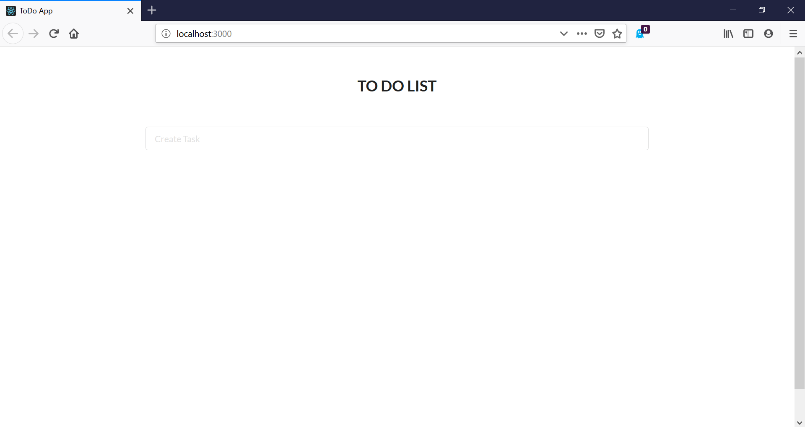
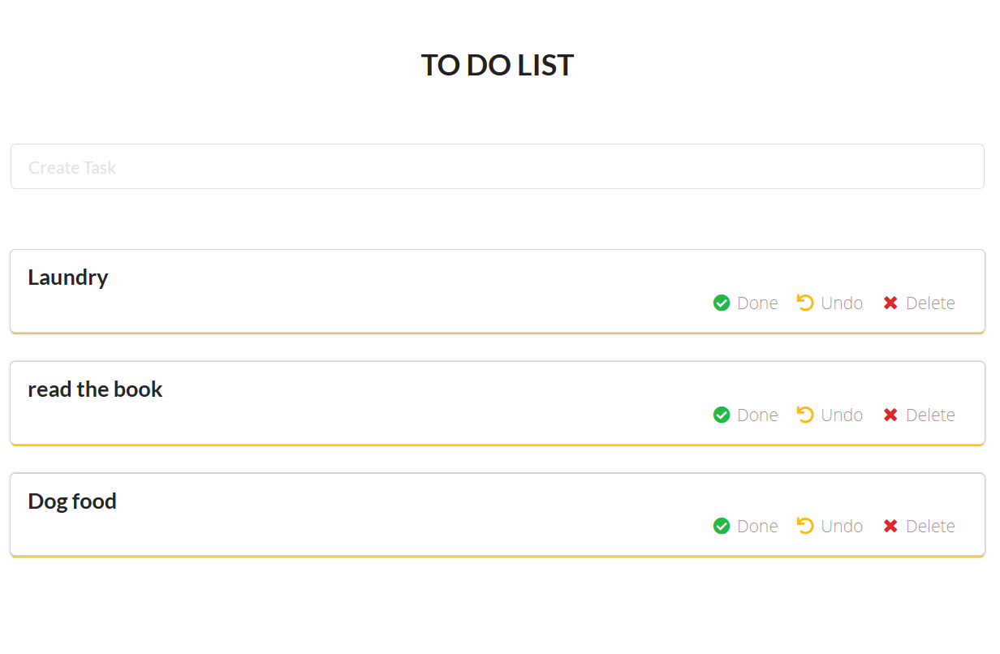
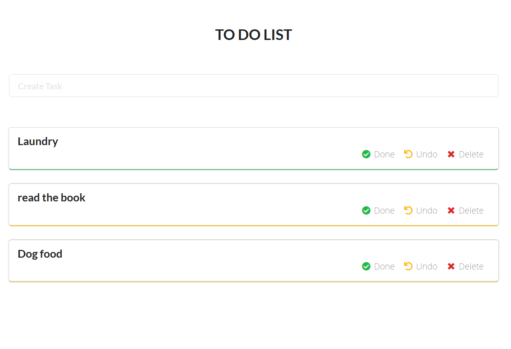
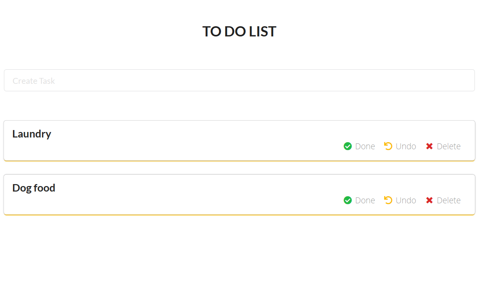

# Get Shit Done

The application is hosted at http://getshitdone.surge.sh

It is a modification of go-to-do-app. In this application instead of using MongoDB
for storing the data, local storage is used.

The application store data in browser's local storage.
You can check in "Inspect" by pressing "F12" or "Ctrl+Shift+I"

Go to Application >> Local Storage

# Start the application

From client directory, you have 2 options either install the complete application or just run the build:

#### build

a. install a server if you don't have one. `npm install -g serve`
b. serve build
c. Open application at http://localhost:5000

#### client

a. install all the dependencies using `npm install`  
 b. start client `npm start`
c. Open application at http://localhost:3000

# Walk through the application

The application is hosted at http://getshitdone.surge.sh
If you just want to check it.

### Index page

### Create task

Enter a task and Submit

### Task Complete

On completion of a task, click "done" Icon of the respective task card.

You'll notice on completion of task, card's bottom line color changed from yellow to green.

### Undo a task

To undone a task, click on "undo" Icon,

You'll notice on completion of task, card's bottom line color changed from green to yellow.

### Delete a task

To delete a task, click on "delete" Icon.

# License

MIT License

Copyright (c) 2019 Shubham Chadokar
